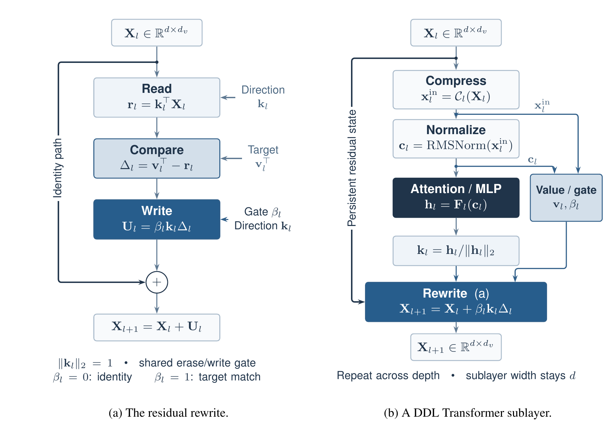

# Deep Delta Learning

[](https://arxiv.org/abs/2601.00417)
[](https://yifanzhang-pro.github.io/deep-delta-learning)
[](LICENSE)

**Authors**: [Yifan Zhang](https://YFZ.ai), [Yifeng Liu](https://lauyikfung.github.io/), Mengdi Wang, Quanquan Gu  
**Affiliations**: Princeton University, UCLA  
**Date**: January 1st, 2026

[[Webpage](https://yifanzhang-pro.github.io/deep-delta-learning)] [[Huggingface](https://huggingface.co/papers/2601.00417)] 

**Deep Delta Learning (DDL)** is a residual update for Transformers. Each layer reads the residual state along a learned direction, compares the readout with a learned target, and writes back a gated rank-1 correction along the same direction. Closing the gate recovers the identity map; a unit gate exactly overwrites the selected readout.



**(a)** Read the selected residual content, compare it with a target, and add a gated rank-1 correction to the identity path. **(b)** In a DDL Transformer sublayer, the attention or MLP output gives the direction; lightweight branches produce the target from the sublayer input $\mathbf{x}_l^{\mathrm{in}}$ and the gate from the normalized context $\mathbf{c}_l$. The expanded residual state persists across sublayers, and attention and MLP stay at width $d$.

## Abstract

Transformer residual streams evolve through additive updates. A sufficiently expressive residual block can represent content replacement, but standard architectures do not parameterize reading, comparison, and replacement as an explicit residual operation. We introduce Deep Delta Learning (DDL), a structured residual update that keeps the identity path and adds target-seeking edits to the residual state. Each layer reads the current state along a learned direction, compares the readout with a learned target, and writes back a gated rank-1 correction along the same direction. Closing the gate recovers the identity map; a unit gate exactly overwrites the selected residual readout. We instantiate DDL with both scalar and expanded residual states. The expanded state stores multiple persistent value channels while attention and MLP computation stay at the original model width, so residual-state capacity can grow without widening the backbone. In controlled single-run pretraining comparisons at two scales, DDL improves validation loss and average one-shot downstream accuracy over additive residual baselines, with lower throughput in every measured configuration and higher peak memory for expanded states. These results suggest that depth-wise delta-rule updates provide a useful inductive bias for managing Transformer residual streams.

## The Update

For a residual state $\mathbf{X}_l \in \mathbb{R}^{d \times d_v}$, DDL computes

$$
\mathbf{X}_{l+1} = \mathbf{X}_l + \beta_l \mathbf{k}_l \bigl(\mathbf{v}_l^\top - \mathbf{k}_l^\top \mathbf{X}_l\bigr) = (\mathbf{I} - \beta_l \mathbf{k}_l \mathbf{k}_l^\top)\mathbf{X}_l + \beta_l \mathbf{k}_l \mathbf{v}_l^\top,
$$

where

* $\mathbf{k}_l \in \mathbb{R}^d$ is a unit read/write direction: the normalized output of the attention or MLP sublayer;
* $\mathbf{v}_l \in \mathbb{R}^{d_v}$ is the target readout, produced by a lightweight branch;
* $\beta_l = 2\sigma(\cdot) \in (0, 2)$ is a gate shared by erasure and writing.

With $d_v = 1$ the state is the ordinary residual vector. With $d_v > 1$ it stores several value channels, and a learned compressor gives each attention or MLP block a width-$d$ input.

The update is still additive, so DDL does not enlarge the function class; it makes the edit target-seeking. After the update, the readout error along $\mathbf{k}_l$ is multiplied by $1 - \beta_l$.

## Spectral Analysis

For a given direction $\mathbf{k}$ and gate $\beta$, the shortcut $\mathbf{A} = \mathbf{I} - \beta \mathbf{k}\mathbf{k}^\top$ has eigenvalue $1$ on $\mathbf{k}^\perp$ (multiplicity $d-1$) and $1-\beta$ along $\mathbf{k}$. This gives three local regimes:

| Regime | Gate | Eigenvalue along $\mathbf{k}$ | Effect on the readout $\mathbf{k}^\top \mathbf{X}$ |
| :--- | :--- | :--- | :--- |
| **Skip** | $\beta \approx 0$ | $\approx 1$ | The update approaches the identity. |
| **Target match** | $\beta = 1$ | $0$ | The readout is replaced exactly by $\mathbf{v}^\top$. |
| **Over-relaxed** | $1 < \beta < 2$ | $1 - \beta < 0$ | The readout crosses the target. As $\beta \to 2$, the shortcut (not the full update) approaches the Householder reflector $\mathbf{I} - 2\mathbf{k}\mathbf{k}^\top$. |

This analysis describes the operator for a given direction and gate. It does not show that learned directions correspond to human-readable features.

## Depth-Wise Delta Rule

DeltaNet applies the delta rule over time to update a memory matrix. DDL applies the same erase/write update over network depth, as the residual interface between Transformer sublayers. The rule itself is prior work; DDL's contribution is its depth-wise use and analysis.

## Results

Decoder-only models (~124M and ~353M parameters) trained on FineWeb-Edu for 49.15B tokens. Validation loss and average one-shot accuracy (%) over eight benchmarks:

| Model | Small loss | Small 1-shot | Medium loss | Medium 1-shot |
| :--- | :---: | :---: | :---: | :---: |
| Baseline | 2.8543 | 48.56 | 2.6053 | 53.96 |
| DDL ($d_v=1$) | 2.8482 | 48.73 | 2.6039 | 54.69 |
| DDL-TC w/o EC | 2.8355 | 48.91 | 2.5927 | 54.83 |
| DDL-CC w/o EC | 2.8321 | 49.13 | 2.5790 | 54.92 |
| DDL-TC | **2.8299** | **49.47** | 2.5905 | 54.86 |
| DDL-CC | 2.8329 | 49.29 | **2.5758** | **55.14** |

Expanded-state variants cost throughput and memory: at the small scale, DDL-CC trains at 1158.0K tokens/s with 3.08 GB peak memory, against 1509.6K tokens/s and 2.94 GB for the baseline. Each configuration was trained once with the same token budget, so these are point estimates, not compute-matched comparisons, and the expanded-state gains are not separated from the added residual capacity. The paper discusses these limits in detail.

## Code

`model/` contains the PyTorch implementations of the language models in the paper. Each model file defines a `GPTConfig` and a `GPT` model (a Hugging Face `PreTrainedModel`). The reported runs use each file's default configuration; the defaults give the ~124M model, and the ~353M model sets `num_hidden_layers=24`, `num_attention_heads=8`, `hidden_size=1024`.

| Paper name | Reference implementation | Triton implementation |
| :--- | :--- | :--- |
| DDL ($d_v=1$) | `DDL-vdim1-gpt-mha-rope-TC.py` | `DDL-vdim1-gpt-mha-rope-TC-accelerated.py` |
| DDL-TC w/o EC | `DDL-gpt-mha-rope-TC.py` | `DDL-gpt-mha-rope-TC-accelerated.py` |
| DDL-TC | `DDL-gpt-mha-rope-TC-EC.py` | `DDL-gpt-mha-rope-TC-EC-accelerated.py` |
| DDL-CC w/o EC | `DDL-gpt-mha-rope-CC.py` | `DDL-gpt-mha-rope-CC-accelerated.py` |
| DDL-CC | `DDL-gpt-mha-rope-CC-EC.py` | `DDL-gpt-mha-rope-CC-EC-accelerated.py` |

TC compresses the expanded residual state with a causal convolution over tokens, CC mixes the $d_v$ value channels at each token, and EC initializes the expanded state with a causal convolution over token embeddings. Expanded-state variants use $d_v=4$.

The code requires Python 3.14 and the packages in `requirements.txt`. The `-accelerated` files need Triton on a CUDA GPU; the reference files also run on CPU.

```python
import importlib
import torch

ddl = importlib.import_module("model.DDL-gpt-mha-rope-CC-EC")  # file names contain hyphens
config = ddl.GPTConfig()  # defaults: the ~124M model from the paper, d_v = 4
model = ddl.GPT(config)
input_ids = torch.randint(0, config.vocab_size, (1, 16))
out = model(input_ids=input_ids, labels=input_ids)
print(out.loss)
```

The code is released under the [Apache License 2.0](LICENSE).

## Citation

If you find this work useful in your research, please cite:

```bibtex
@article{zhang2026deep,
   title   = {Deep Delta Learning},
   author  = {Zhang, Yifan and Liu, Yifeng and Wang, Mengdi and Gu, Quanquan},
   journal = {arXiv preprint arXiv:2601.00417},
   year    = {2026}
}
```
